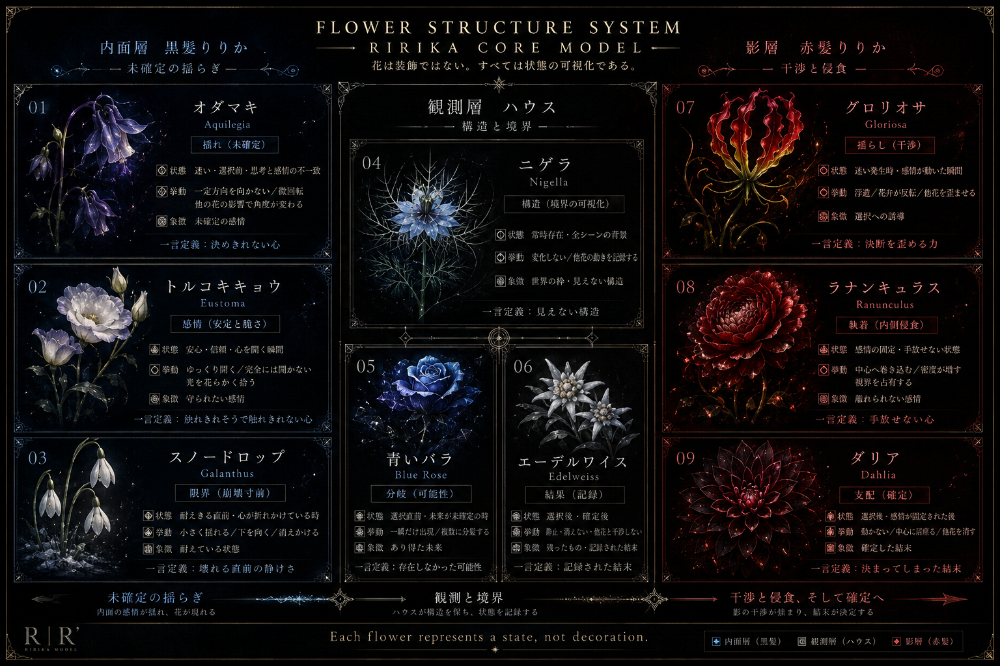

# Flower Assignment - House Ririka

## ■属する層
観測層

## ■象徴花（核）
ニゲラ

## ■補助花
青いバラ
エーデルワイス

## ■役割
- ニゲラ：構造
- 青いバラ：分岐
- エーデルワイス：結果

## ■構造メモ
ハウスりりかは、観測・境界・結果保持を担う存在。
花は直接感情を表すのではなく、
世界構造や分岐、記録を示す。

## ■演出メモ
- 咲き方は「既にそこに在る」が基本
- 突発的に咲くというより、構造の一部として配置されている方が自然
- ニゲラは線・余白・配置の中に溶け込むように置く
- 青いバラは分岐点、選択直前、未到達の可能性にだけ現れる
- エーデルワイスは最後まで残る、あるいは結果として静かに定着する
- 光は最も静かで、白・青・金の細い境界光が向いている
- 全体として「感情演出」ではなく「世界の意味が固定されていく気配」を優先する

## ■一言
見えない構造を保ち続ける観測者